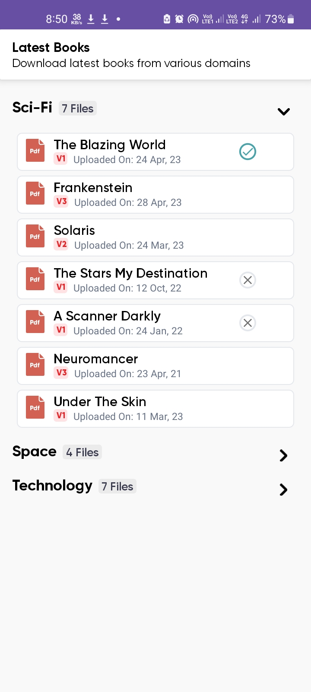

# Book Downloader #

A demo app built using modern Android tech stack and MVVM architecture pattern. It fetches data from
network about books. The pdf file attached with each book can be downloaded.

## App Preview ##

  

## Tech Stack and Features ##

- Coroutines and Kotlin
- Dagger-Hilt for Dependency Injection
- MVVM architecture and Repository Pattern
- Retrofit for network requests
- Material Design and Property Animation
- Nested Recycler View
- Custom Fonts
- Downloading Files using System Download Manager
- Parallel downloads and progress tracking and Cancel downloads
- Data Binding and Binding Adapters 